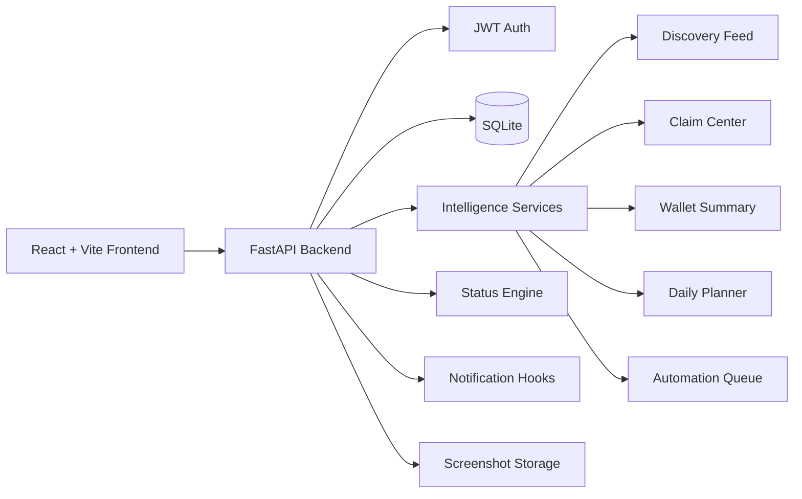

# Airdrop Intelligence Platform

<p align="center">
  <strong>A full-stack intelligence workspace for discovering, scoring, tracking, and operating crypto airdrop workflows.</strong>
</p>

<p align="center">
  <a href="#overview">Overview</a>
  |
  <a href="#features">Features</a>
  |
  <a href="#architecture">Architecture</a>
  |
  <a href="#quick-start">Quick Start</a>
  |
  <a href="#api-surface">API</a>
  |
  <a href="#roadmap">Roadmap</a>
</p>

<p align="center">
  
  
  
  
  
</p>

## Overview

Airdrop Intelligence Platform is a secure operations dashboard for people who track many airdrop campaigns, wallets, browser identities, claim windows, and farming tasks in one place.

The project combines a FastAPI backend, a modern React frontend, profile management, campaign lifecycle tracking, scoring heuristics, claim reminders, wallet summaries, discovery candidates, and automation-ready workflow foundations. It is designed to move from a local operator tool into a production platform with stronger persistence, background jobs, integrations, and deployment automation.

## Why This Exists

Airdrop work becomes difficult when campaign research, wallet activity, identities, deadlines, claims, and task execution are spread across notes, browsers, spreadsheets, and chats. This platform turns that scattered process into one structured workspace:

| Problem | Platform Answer |
| --- | --- |
| Too many projects to compare manually | Intelligence scoring and recommendation signals |
| Profiles and wallets become hard to organize | Dedicated farming profile manager |
| Claim dates and snapshots are easy to miss | Claim center and reminder foundation |
| Campaign status is hard to keep current | Lifecycle pipeline with status refresh logic |
| Execution evidence is scattered | Progress records and screenshot-ready workflow hooks |
| Frontend calls become brittle across environments | Central API client with `VITE_API_URL` support |

## Features

### Intelligence Dashboard

- High-level metrics for active campaigns, farming profiles, recommendations, and claims
- AI-style recommendation cards powered by scoring heuristics
- Discovery feed foundation for candidate sources such as Galxe, Layer3, and Zealy
- Wallet overview with seeded balance, gas, and activity summaries
- Daily farming planner with task estimates, cost, and priority
- Automation queue view for scheduled refresh and reminder flows

### Campaign Tracking

- Airdrop lifecycle columns for `NEW`, `ONGOING`, `COMPLETED`, `CLAIMABLE`, and `ENDED`
- Authenticated endpoints for listing, creating, and updating campaigns
- Reward type and reward amount fields
- Deadline and claim link support
- Status refresh engine for deriving campaign state from progress and deadlines

### Profile Operations

- Create and list isolated farming identities
- Store email, wallet, Chrome debug port, Chrome profile name, X handle, Discord handle, proxy label, location, and notes
- Legacy SQLite migration support for older profile schemas
- Profile ownership checks before workflow execution

### Authentication And Security

- JWT login and authenticated API access
- Password hashing with bcrypt
- Frontend token injection through a shared Axios client
- Automatic frontend session cleanup when auth expires
- Optional notification integrations that do not break core auth when unavailable

### Workflow Foundation

- Progress table for task execution records
- Screenshot storage paths under `backend/screenshots`
- Playwright-ready profile automation utilities
- Cleanup job for old completed progress records
- Notification hooks for Discord, Telegram, and X

## Architecture



### Backend

| Area | Files |
| --- | --- |
| API routes | `backend/main.py` |
| Authentication | `backend/auth.py` |
| Persistence and migrations | `backend/database.py` |
| Pydantic models | `backend/models.py` |
| Browser profile automation | `backend/profile_manager.py` |
| Status evaluation | `backend/status_engine.py` |
| Notifications | `backend/notifier.py` |
| Scoring, discovery, claims, wallets, planner, scheduler | `backend/services/` |

### Frontend

| Area | Files |
| --- | --- |
| App routing and auth bootstrapping | `frontend/src/App.jsx` |
| Shared API client | `frontend/src/api.js` |
| Reusable shell, nav, icons, empty states | `frontend/src/components/ui.jsx` |
| Intelligence dashboard | `frontend/src/components/Dashboard.jsx` |
| Login and registration | `frontend/src/components/Login.jsx` |
| Farming profiles | `frontend/src/components/ProfileManager.jsx` |
| Airdrop tracker | `frontend/src/components/AirdropTracker.jsx` |
| Global styling | `frontend/src/index.css` |

## Tech Stack

| Layer | Tools |
| --- | --- |
| Backend API | FastAPI, Uvicorn |
| Backend models | Pydantic |
| Authentication | JWT, bcrypt |
| Database | SQLite |
| Frontend | React, Vite |
| Styling | Tailwind CSS |
| HTTP client | Axios |
| Automation foundation | Playwright-ready profile utilities |
| Testing | Pytest, Vite build checks |

## Project Structure

```text
.
|-- backend/
|   |-- auth.py
|   |-- config.py
|   |-- database.py
|   |-- main.py
|   |-- models.py
|   |-- notifier.py
|   |-- profile_manager.py
|   |-- scraper.py
|   |-- status_engine.py
|   |-- services/
|   |   |-- claims.py
|   |   |-- discovery.py
|   |   |-- intelligence.py
|   |   |-- planner.py
|   |   |-- scheduler.py
|   |   `-- wallets.py
|   `-- tests/
|-- frontend/
|   |-- .env.example
|   |-- package.json
|   |-- vite.config.js
|   `-- src/
|       |-- api.js
|       |-- App.jsx
|       |-- main.jsx
|       `-- components/
`-- README.md
```

## Quick Start

### 1. Clone And Enter The Project

```bash
git clone <your-repository-url>
cd Airdrop-Intelligence-Platform
```

### 2. Start The Backend

```bash
python -m pip install -r backend/requirements.txt
python -m uvicorn backend.main:app --reload --host 127.0.0.1 --port 8000
```

The API will be available at:

```text
http://127.0.0.1:8000
```

Interactive API docs:

```text
http://127.0.0.1:8000/docs
```

### 3. Start The Frontend

```bash
cd frontend
npm install
npm run dev
```

The UI will be available at:

```text
http://127.0.0.1:5173
```

## Configuration

The frontend defaults to:

```text
http://localhost:8000
```

For another backend origin, copy the example env file:

```bash
cp frontend/.env.example frontend/.env
```

Then set:

```bash
VITE_API_URL=https://api.example.com
```

Backend configuration lives in `backend/config.py` and currently includes:

| Setting | Purpose |
| --- | --- |
| `SECRET_KEY` | JWT signing key |
| `ACCESS_TOKEN_EXPIRE_MINUTES` | Auth token lifetime |
| `DB_PATH` | SQLite database path |
| `SCREENSHOT_BASE` | Screenshot storage directory |
| `CLEANUP_HOURS` | Completed progress cleanup window |
| Notification tokens and webhooks | Discord, Telegram, and X integration hooks |

## API Surface

| Method | Endpoint | Purpose |
| --- | --- | --- |
| `POST` | `/auth/register` | Create a user |
| `POST` | `/auth/login` | Log in and receive a JWT |
| `GET` | `/auth/me` | Read the current authenticated user |
| `GET` | `/dashboard` | Load dashboard intelligence data |
| `GET` | `/airdrops` | List campaigns grouped by status |
| `POST` | `/airdrops` | Create a campaign |
| `PATCH` | `/airdrops/{airdrop_id}/status` | Update campaign lifecycle status |
| `GET` | `/profiles` | List farming profiles |
| `POST` | `/profiles` | Create a farming profile |
| `POST` | `/step` | Store workflow execution progress |
| `GET` | `/notifications` | List notification logs |
| `POST` | `/refresh` | Re-evaluate campaign statuses |

## Data Model

Core entities:

- `users`: authenticated platform users
- `profiles`: farming identities tied to users
- `airdrops`: tracked campaigns and lifecycle status
- `tasks`: campaign task definitions
- `progress`: execution records and screenshot references
- `notifications`: sent notification logs

SQLite is used for local development. The database layer includes lightweight migrations for older local schemas, including legacy profile, airdrop, and progress table shapes.

## Testing

Run backend tests:

```bash
python -m pytest backend/tests -q
```

Build the frontend:

```bash
cd frontend
npm run build
```

Current test coverage focuses on:

- Intelligence scoring
- Discovery feed data
- Claim queue data
- Scheduler and planner services
- Wallet summaries
- Legacy database migration behavior

## Roadmap

The platform is structured to grow into a complete airdrop operations system:

1. Replace SQLite with PostgreSQL and Alembic migrations
2. Add Redis-backed caching and queueing
3. Expand discovery integrations across Galxe, Layer3, Zealy, TaskOn, and custom sources
4. Add real wallet indexing and portfolio analytics
5. Build campaign creation and task execution directly into the UI
6. Add background workers for reminders, score refreshes, and claim checks
7. Improve notification delivery with user-level preferences
8. Add deployment profiles for Docker, cloud hosting, and production secrets

## Quality Notes

- Keep API contracts typed through Pydantic models.
- Keep frontend API calls centralized in `frontend/src/api.js`.
- Treat notification providers as optional integrations.
- Keep database migrations backward compatible with existing local SQLite files.
- Add tests for every new shared service or schema migration.

## License

Add a license before distributing this project publicly.
