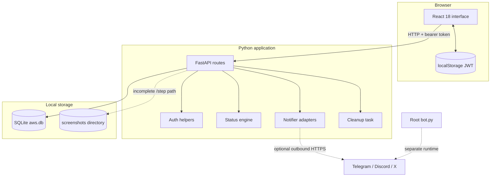

# 🏗️ Architecture

[Documentation](README.md) / Architecture

## System context



## Runtime components

| Component | Technology | Responsibility |
|---|---|---|
| Frontend | React, React Router, Axios, Tailwind CSS, Vite | Auth flow, dashboard, profile create/list, campaign create/board/status edit |
| API | FastAPI, Pydantic | Validation, auth dependencies, user-scoped routes, dashboard derivation |
| Auth | `python-jose`, bcrypt | Password hashing, JWT creation and verification |
| Persistence | Python `sqlite3` | Tables, compatibility migration, CRUD, cleanup |
| Status engine | Async Python helpers | Evaluate campaign lifecycle for one user |
| Notifications | `httpx`, optional Tweepy | Best-effort Discord, Telegram, and X status messages |
| Evidence | Local filesystem | Intended timestamped screenshot files under `backend/screenshots/` |
| Root broadcaster | `python-telegram-bot`, `discord.py` | Independent `/test` broadcast verification |

## Repository boundaries

```text
.
├── backend/
│   ├── main.py                 # FastAPI app and routes
│   ├── auth.py                 # bcrypt/JWT helpers
│   ├── database.py             # SQLite schema and queries
│   ├── models.py               # Pydantic models and enums
│   ├── status_engine.py        # lifecycle evaluation
│   ├── notifier.py             # optional outbound adapters
│   ├── profile_manager.py      # unwired Playwright profile helpers
│   ├── scraper.py              # prototype discovery scraper
│   ├── services/               # scoring plus sample/foundation services
│   └── tests/                  # pytest suite
├── frontend/
│   ├── src/api.js              # Axios client and auth interceptors
│   ├── src/App.jsx             # auth state and routes
│   └── src/components/         # pages and shared shell
├── bot.py                      # separate Telegram/Discord broadcaster
├── config.py                   # root broadcaster placeholders
└── docs/                       # documentation system
```

## Domain model

```mermaid
erDiagram
    USERS ||--o{ PROFILES : owns
    USERS ||--o{ AIRDROPS : owns
    AIRDROPS ||--o{ TASKS : defines
    PROFILES ||--o{ PROGRESS : records
    TASKS ||--o{ PROGRESS : receives
    AIRDROPS ||--o{ NOTIFICATIONS : generates

    USERS { int id PK; text username UK; text hashed_password }
    PROFILES { int id PK; int user_id FK; text email; text wallet; int chrome_port }
    AIRDROPS { int id PK; int user_id FK; text project_name; text status; text claim_link }
    TASKS { int id PK; int airdrop_id FK; text task_name; text task_type }
    PROGRESS { int id PK; int profile_id FK; int task_id FK; text status; text screenshot_path }
    NOTIFICATIONS { int id PK; int airdrop_id FK; text platform; text message }
```

## Trust boundaries

### Browser → API

- Browser input is untrusted; Pydantic validates request shapes and typed URLs/dates.
- Protected routes use the bearer-token dependency.
- Frontend route guards improve UX but are not authorization controls.

### API → database

- Queries use parameter binding.
- Profile and campaign lists are filtered by `user_id`.
- Campaign status changes check ownership.
- `/step` checks profile ownership, but its model/handler mismatch must be fixed before use; task/campaign relationship validation also deserves review.

### API → filesystem and external services

Evidence can contain sensitive data. Operators must control directory access, quotas, retention, and backups. Notifier adapters suppress failures and provide no retry queue, delivery receipt, or per-user destination.

## Lifecycle tasks

At startup, FastAPI creates/migrates tables, starts a currently incomplete 12-hour status loop, and starts daily progress-row cleanup. At shutdown, background tasks are cancelled and awaited.

## Architectural constraints

| Constraint | Current impact |
|---|---|
| SQLite + local files | Best suited to local/single-instance use |
| Python constant configuration | No backend environment loader is implemented |
| Browser `localStorage` JWT | Exposed to successful same-origin XSS |
| Broad CORS list including `*` | Must be narrowed before untrusted deployment |
| Best-effort notifications | No retries, queue, audit write, or delivery confirmation |
| Incomplete `/step` model | Progress/evidence endpoint is not safely consumable as checked in |
| Placeholder scraper sources | Discovery scraper is not a production feed |

## Extension principles

1. Preserve user ownership at the query boundary.
2. Keep signing and chain code outside profile metadata and route layers.
3. Add explicit provider interfaces before external integrations.
4. Treat third-party responses and evidence as untrusted.
5. Add tests before documenting a capability as shipped.
6. Update [Security](security.md), [Configuration](configuration.md), and [Changelog](changelog.md) with behavior changes.

---

[← How It Works](how-it-works.md) · [Getting Started →](getting-started.md)
