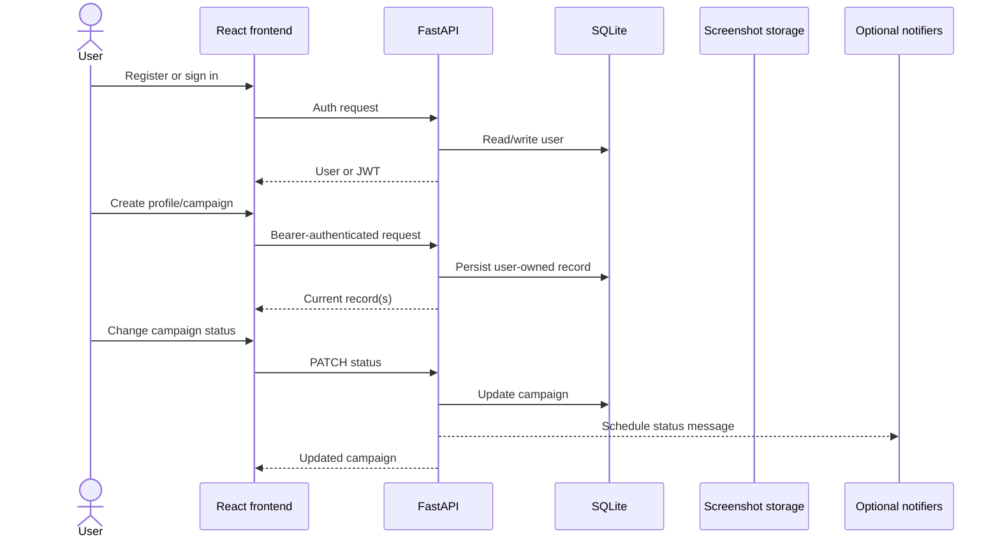
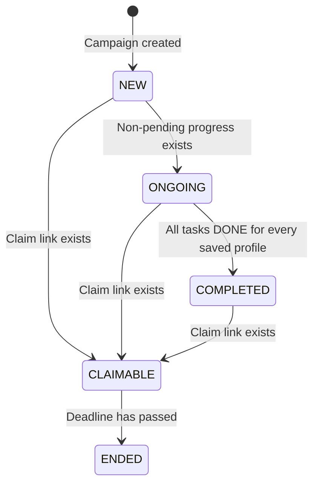

# ⚙️ How It Works

[Documentation](README.md) / How It Works

This guide follows data from the browser to FastAPI, SQLite, evidence storage, status evaluation, and optional notification channels.

## System flow

## 1. Authentication and session handling

1. `POST /auth/register` accepts JSON with a username and password.
2. The backend hashes the password with bcrypt and stores only the hash.
3. `POST /auth/login` accepts OAuth2 form fields and returns a signed JWT.
4. The frontend stores that token under `token` in browser `localStorage`.
5. The shared Axios client adds `Authorization: Bearer <token>` to requests.
6. `GET /auth/me` restores the signed-in user after a page reload.
7. A `401` response clears the token and returns the interface to sign-in.

> [!NOTE]
> The frontend and API enforce a minimum password length of eight characters. The backend bcrypt helper also rejects passwords longer than 72 UTF-8 bytes.

## 2. Farming profiles

Profiles are user-owned identity metadata records. The frontend can create and list them through `POST /profiles` and `GET /profiles`.

| Field | Required by API | Purpose |
|---|---:|---|
| `email` | Yes | Profile label/contact metadata |
| `wallet` | Yes | Wallet address or identifier stored as text |
| `chrome_port` | Yes | Chrome remote-debugging port metadata |
| `chrome_profile` | No | Browser profile name |
| `x_handle` | No | X account label |
| `discord_handle` | No | Discord account label |
| `ip_address` | No | IP/proxy label; defaults to an empty string |
| `location` | No | Location label; defaults to an empty string |
| `notes` | No | Free-form operational notes |

No profile field causes a wallet connection, browser launch, proxy connection, or social action in the primary application.

## 3. Campaigns and tasks

The Airdrop Tracker creates campaigns through `POST /airdrops`. Every new campaign starts in `NEW` and belongs to the authenticated user.

Required campaign values are project name, valid HTTP(S) website URL, reward type, and deadline. Reward amount and claim link are optional. The campaign dialog can also submit optional task objects.

## 4. Dashboard derivation

`GET /dashboard` reads only the current user's campaigns, profiles, and progress, then derives:

- **active projects** — anything not `COMPLETED` or `ENDED`;
- **recommendations** — up to five deterministic scores based on task count, completion, deadline urgency, and calculated risk;
- **claims** — campaigns marked `CLAIMABLE` or carrying a claim link;
- **wallet cards** — one per profile; balances and gas remain unconnected placeholders;
- **planner items** — remaining API-defined tasks for active campaigns;
- **discovery cards** — the user's tracked campaigns labeled with source `Tracked`; and
- **scheduler** — currently an empty list in the primary dashboard response.

> [!IMPORTANT]
> “AI recommendations” is a UI label. The checked-in implementation uses local deterministic weighting in `backend/services/intelligence.py`; it does not call an AI model or external intelligence service.

## 5. Progress and evidence

The intended `POST /step` flow validates profile ownership, writes screenshot bytes below `backend/screenshots/<airdrop_id>/<profile_id>/`, inserts a `DONE` progress row, and schedules an optional notification.

> [!CAUTION]
> The `/step` handler validates ownership, task/campaign relationships, image content, evidence storage, and progress insertion. The frontend does not expose a progress submission screen, so callers should treat this as an API-level workflow and use the backend tests as the contract.

`backend/profile_manager.py` contains Playwright-assisted browser/screenshot helpers. They are not invoked by the current frontend or FastAPI routes.

## 6. Status lifecycle

Users can choose any supported status manually. Automatic evaluation occurs when authenticated `POST /refresh` calls `refresh_statuses_for_user()`.

> [!NOTE]
> A background status task starts with the API and sleeps on a 12-hour interval, but its current loop contains a TODO and does not enumerate users or refresh records. The dashboard's **Refresh data** button reloads data; it does not call `POST /refresh`.

## 7. Notifications and cleanup

Manual status changes, evidence submissions, and authenticated `/refresh` transitions schedule optional Discord webhook, Telegram Bot API, and X messages through FastAPI background tasks. Each workflow event is recorded in the user-owned notification table before best-effort provider dispatch; a row does not confirm external delivery. Missing credentials disable each adapter and adapter exceptions are swallowed. The periodic status loop remains incomplete and does not currently dispatch transitions.

The API also runs daily cleanup of `DONE` progress rows older than `CLEANUP_HOURS` (72 by default) and safely removes corresponding in-root screenshot files when possible.

## 8. Separate root broadcaster

The root `bot.py` process is independent of FastAPI and React. Telegram `/test` replies to the sender and attempts one fixed test broadcast to configured Telegram and Discord destinations. It does not read the application database or execute airdrop tasks.

## 9. Prototype and sample services

`backend/scraper.py` contains placeholder source URLs and Playwright parsing helpers. Static claim, discovery, planner, scheduler, and wallet service fixtures support tests/future work but are not returned by the primary dashboard. See [Backend](backend.md#supporting-services) and [Networks](networks.md).

---

[← Introduction](introduction.md) · [Architecture →](architecture.md)
