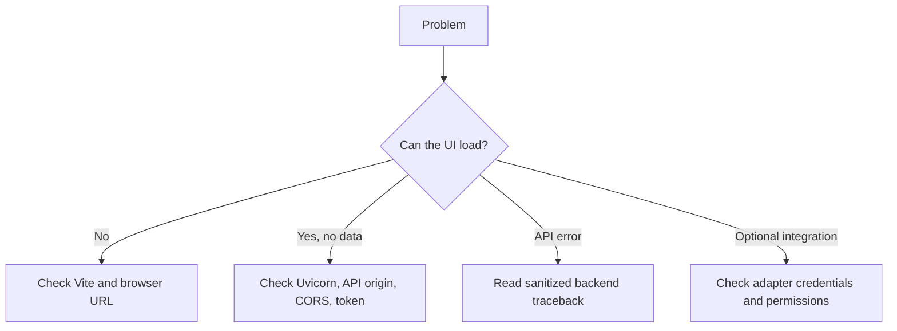

# 🛠️ Troubleshooting

[Documentation](README.md) / Troubleshooting

Start by checking the terminal running Uvicorn or Vite. Preserve the status code and traceback, but remove tokens, passwords, wallet identifiers, database files, screenshots, and personal metadata before sharing diagnostics.

## Quick diagnosis



## Application and frontend

| Symptom | Checks and fixes |
|---|---|
| `localhost:5173` does not open | Run `cd frontend && npm install && npm run dev`; use the URL printed by Vite. |
| UI loads but requests fail | Confirm Uvicorn is running on `127.0.0.1:8000` and `VITE_API_URL` points to the same origin. Restart Vite after changing the variable. |
| Browser reports CORS failure | Check the requested origin against the list in `backend/main.py`. For a deployment, deliberately configure a narrow allow-list rather than broadening it casually. |
| UI remains on sign-in | Register first, use the same username/password, inspect the login request status, and confirm the backend database is writable. |
| UI returns to sign-in after working | The API returned `401`; the Axios interceptor clears `localStorage.token`. Sign in again and investigate token expiry or `SECRET_KEY` changes. |
| Dashboard says it cannot load data | Check the backend traceback and request `/docs`; then retry after confirming the account has valid user-scoped records. |
| Dashboard panels are empty | Empty profiles/campaigns produce empty states. The scheduler is currently empty, and discovery/wallet sections are not live external feeds. |
| Build fails | Run `npm install` in `frontend/`, read the first compiler error, and run `npm run build` from the frontend directory. |

## Backend and database

| Symptom | Checks and fixes |
|---|---|
| Uvicorn cannot import `backend.main` | Activate the virtual environment, install `backend/requirements.txt`, and run the command from the repository root. |
| Registration fails with a database error | Check write permissions for the directory containing `DB_PATH`; do not delete the database before taking a backup. |
| Login returns `401` | Login expects OAuth2 form fields (`username` and `password`), not a JSON body. Confirm the account exists and the password is correct. |
| Campaign is not visible | Campaign queries are user-scoped. Confirm you are signed into the user that created it and inspect `GET /airdrops` with that bearer token. |
| Status does not change automatically | Use authenticated `POST /refresh`. The dashboard **Refresh data** action only reloads data, and the startup 12-hour loop is incomplete. |
| Old progress disappears | Daily cleanup removes `DONE` progress older than `CLEANUP_HOURS` (72 by default). Screenshot file deletion is not implemented. |
| `/step` returns an unexpected server error | The current model/handler contract reads `execution.airdrop_id` although the checked-in model does not define it. Do not use this path as-is; fix and test the contract first. |

## Optional integrations

| Symptom | Checks and fixes |
|---|---|
| Telegram backend notification is absent | Configure both `TELEGRAM_BOT_TOKEN` and `TELEGRAM_CHAT_ID` in backend configuration; missing values disable the adapter. |
| Discord backend notification is absent | Configure `DISCORD_WEBHOOK_URL` and verify the webhook is active. |
| X notification is absent | Install backend dependencies and provide all four values used by Tweepy: API key, API secret, access token, and access-token secret. |
| Notification errors do not appear in the UI | Current notifier failures are swallowed and no notification-log rows are written; inspect backend logs and provider-side permissions. |
| Root broadcaster cannot find Discord channel | Check the integer `DISCORD_CHANNEL_ID`, bot login, guild/channel access, and send permission. |
| Root broadcaster does not respond to `/test` | Check `TELEGRAM_BOT_TOKEN`, network access, polling logs, and that the command is sent to the correct bot. |
| One broadcaster destination fails | Telegram and Discord sends are attempted independently; inspect the corresponding log entry without exposing the token. |

## Playwright helpers

Only the helper paths that use Playwright need browser binaries:

```bash
python -m playwright install chromium
```

The normal React workflow does not launch a browser automation session. A Chrome debugging port stored in a profile is metadata unless an external caller invokes the helper module.

## Safe support bundle

Include:

- operating system and Python/Node versions;
- the exact command that failed;
- sanitized HTTP status and endpoint;
- relevant dependency versions; and
- a short reproduction sequence.

Do not include `.env` files, `config.py` with real values, `backend/aws.db`, screenshot directories, bearer tokens, or raw personal data.

---

[← Security](security.md) · [FAQ →](faq.md)
